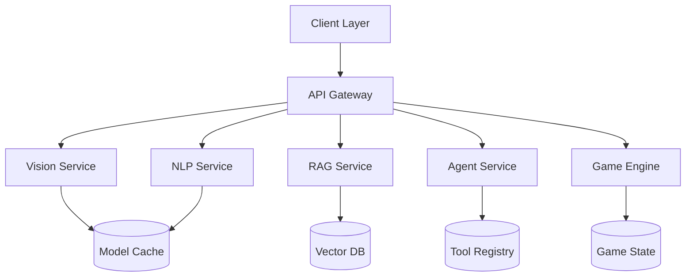

# VisionQuest 🎯

> **Multi-Modal AI Platform**: Vision-Language Understanding × Text LLM × RAG/Agent × Interactive Text Adventure Game

A portable, production-ready MVP that seamlessly integrates computer vision, natural language processing, knowledge retrieval, and gamification into a unified platform. Built for researchers, developers, and AI enthusiasts who want cutting-edge multi-modal capabilities without the complexity.

[](https://www.python.org/downloads/)
[](https://fastapi.tiangolo.com)
[](https://opensource.org/licenses/MIT)
[](https://docs.docker.com/compose/)

## 🚀 Quick Start

### One-Command Launch (Docker)
```bash
# Clone and launch everything
git clone https://github.com/your-username/visionquest.git
cd visionquest
cp .env.example .env
docker-compose up -d
```

🌐 **Access Points**:
- **API Docs**: http://localhost:8000/docs
- **Gradio UI**: http://localhost:7860
- **React Web**: http://localhost:3000
- **Health Check**: http://localhost:8000/health

### Local Development Setup
```bash
# Backend (Conda environment)
conda create -n multi-modal-lab python=3.10
conda activate multi-modal-lab
pip install -r requirements.txt

# Start FastAPI server
uvicorn backend.app.main:app --reload --host 0.0.0.0 --port 8000

# Frontend options
# 1. Gradio (fastest to test)
cd frontend/gradio_app && python app.py

# 2. React Web App
cd frontend/react_app && npm install && npm run dev

# 3. PyQt Desktop App
cd frontend/pyqt_app && python app.py
```

## ✨ Core Features

### 🔍 **Vision-Language Understanding**
- **Image Captioning**: BLIP-2/BLIP-3 powered natural language descriptions
- **Visual Q&A**: LLaVA and Qwen-VL models for intelligent image questioning
- **Multi-language Support**: Enhanced Chinese/Traditional Chinese capabilities
- **Batch Processing**: Handle hundreds of images efficiently

### 💬 **Advanced Text Processing**
- **Conversational AI**: Qwen/Llama-3 integration with memory and context
- **Structured Output**: JSON, XML, code generation with format validation
- **Multi-turn Dialogue**: Persistent conversation history and persona
- **Safety Filters**: NSFW detection, content moderation, sensitive topic filtering

### 🧠 **RAG & Knowledge Integration**
- **Vector Search**: FAISS/PGVector powered semantic retrieval
- **Citation Support**: Source attribution and reference tracking
- **Document Processing**: PDF, TXT, MD ingestion with chunking
- **Hybrid Search**: Combine semantic and keyword-based retrieval

### 🛠️ **Intelligent Agent System**
- **Tool Registry**: YAML-based extensible function calling
- **Task Decomposition**: Break complex requests into actionable steps
- **File Operations**: Read, search, analyze local documents
- **Web Integration**: API calls, data fetching, real-time information

### 🎮 **Interactive Text Adventure Game**
- **Dynamic Storytelling**: AI-driven narrative generation
- **Character Personas**: Rich personality systems with memory
- **Branching Scenarios**: Player choice-driven storylines
- **Multi-genre Support**: Fantasy, sci-fi, mystery, custom scenarios

## 🏗️ Architecture Overview



### 🔧 **Technology Stack**

| Component | Technology | Purpose |
|-----------|------------|---------|
| **Backend** | FastAPI + Uvicorn | High-performance async API |
| **Vision Models** | BLIP-2, LLaVA, Qwen-VL | Image understanding |
| **Text Models** | Qwen-2.5, Llama-3 | Conversation & reasoning |
| **Vector DB** | FAISS / PGVector | Semantic search |
| **Task Queue** | Celery + Redis | Background processing |
| **Frontend** | Gradio + React + PyQt | Multi-platform UIs |
| **Deployment** | Docker + Compose | Containerized services |

## 📡 API Reference

### **Vision Endpoints**

#### Image Captioning
```bash
POST /api/v1/caption
Content-Type: multipart/form-data

# Request
{
  "image": [file],
  "model": "blip2-opt-2.7b",
  "max_length": 100,
  "language": "en"
}

# Response
{
  "caption": "A beautiful sunset over the mountains with clouds in the sky",
  "confidence": 0.92,
  "model_used": "blip2-opt-2.7b",
  "processing_time": 1.23
}
```

#### Visual Question Answering
```bash
POST /api/v1/vqa
Content-Type: multipart/form-data

# Request
{
  "image": [file],
  "question": "What color is the car in the image?",
  "model": "llava-1.5-7b"
}

# Response
{
  "answer": "The car in the image is red.",
  "confidence": 0.88,
  "reasoning": "Based on the visual analysis of the vehicle's paint color..."
}
```

### **Text & Conversation**

#### Chat Completion
```bash
POST /api/v1/chat
Content-Type: application/json

# Request
{
  "messages": [
    {"role": "system", "content": "You are a helpful assistant."},
    {"role": "user", "content": "Explain quantum computing"}
  ],
  "model": "qwen2.5-7b",
  "max_tokens": 500,
  "temperature": 0.7
}

# Response
{
  "response": "Quantum computing is a revolutionary computing paradigm...",
  "usage": {
    "prompt_tokens": 23,
    "completion_tokens": 187,
    "total_tokens": 210
  }
}
```

### **RAG & Knowledge**

#### Knowledge Query
```bash
POST /api/v1/rag/ask
Content-Type: application/json

# Request
{
  "question": "What are the benefits of renewable energy?",
  "collection": "environmental_docs",
  "top_k": 5,
  "include_citations": true
}

# Response
{
  "answer": "Renewable energy offers several key benefits...",
  "citations": [
    {
      "source": "renewable_report_2024.pdf",
      "page": 15,
      "confidence": 0.94
    }
  ]
}
```

### **Agent & Tools**

#### Agent Action
```bash
POST /api/v1/agent/act
Content-Type: application/json

# Request
{
  "task": "Find and summarize recent papers about computer vision",
  "tools": ["file_search", "web_search", "summarizer"],
  "max_steps": 5
}

# Response
{
  "result": "I found 3 relevant papers...",
  "steps": [
    {"tool": "web_search", "action": "searched for CV papers", "result": "..."},
    {"tool": "summarizer", "action": "summarized findings", "result": "..."}
  ]
}
```

### **Game Engine**

#### Start New Game
```bash
POST /api/v1/game/new
Content-Type: application/json

# Request
{
  "scenario": "fantasy_adventure",
  "persona": {
    "name": "Alex",
    "background": "A young mage seeking ancient knowledge"
  },
  "difficulty": "medium"
}

# Response
{
  "game_id": "game_123456",
  "initial_scene": "You stand at the entrance of the Forbidden Library...",
  "choices": [
    {"id": "A", "text": "Enter the library quietly"},
    {"id": "B", "text": "Call out to announce your presence"},
    {"id": "C", "text": "Search for another entrance"}
  ]
}
```

#### Game Step
```bash
POST /api/v1/game/step
Content-Type: application/json

# Request
{
  "game_id": "game_123456",
  "choice": "A",
  "custom_action": null
}

# Response
{
  "narrative": "You slip into the ancient library, your footsteps muffled by thick carpets...",
  "choices": [...],
  "game_state": {
    "scene": "library_entrance",
    "inventory": ["spell_book", "healing_potion"],
    "health": 100
  }
}
```

### **Batch Processing**

#### Batch Caption
```bash
POST /api/v1/batch/caption
Content-Type: multipart/form-data

# Request
{
  "images": [file1, file2, file3, ...],
  "options": {
    "model": "blip2-opt-2.7b",
    "max_length": 100,
    "export_format": "csv"
  }
}

# Response
{
  "task_id": "batch_abc123",
  "status": "processing",
  "total_items": 50,
  "estimated_time": "5 minutes"
}
```

#### Task Status
```bash
GET /api/v1/tasks/{task_id}

# Response
{
  "task_id": "batch_abc123",
  "status": "completed",
  "progress": 100,
  "results_url": "/api/v1/tasks/batch_abc123/download",
  "summary": {
    "total_processed": 50,
    "successful": 48,
    "failed": 2
  }
}
```

## 🎯 Usage Examples

### **Python Client**
```python
import requests
from pathlib import Path

# Initialize client
base_url = "http://localhost:8000/api/v1"

# Caption an image
with open("photo.jpg", "rb") as f:
    response = requests.post(
        f"{base_url}/caption",
        files={"image": f},
        data={"model": "blip2-opt-2.7b"}
    )
    caption = response.json()["caption"]
    print(f"Caption: {caption}")

# Ask a question about an image
with open("diagram.png", "rb") as f:
    response = requests.post(
        f"{base_url}/vqa",
        files={"image": f},
        data={"question": "What is the main component in this diagram?"}
    )
    answer = response.json()["answer"]
    print(f"Answer: {answer}")

# Chat conversation
messages = [
    {"role": "user", "content": "Explain machine learning"}
]
response = requests.post(
    f"{base_url}/chat",
    json={"messages": messages, "model": "qwen2.5-7b"}
)
reply = response.json()["response"]
print(f"AI: {reply}")
```

### **JavaScript/React Client**
```javascript
// Image captioning
const captionImage = async (imageFile) => {
  const formData = new FormData();
  formData.append('image', imageFile);
  formData.append('model', 'blip2-opt-2.7b');

  const response = await fetch('/api/v1/caption', {
    method: 'POST',
    body: formData,
  });

  const result = await response.json();
  return result.caption;
};

// Chat completion
const chatWithAI = async (messages) => {
  const response = await fetch('/api/v1/chat', {
    method: 'POST',
    headers: {
      'Content-Type': 'application/json',
    },
    body: JSON.stringify({
      messages,
      model: 'qwen2.5-7b',
      max_tokens: 500,
    }),
  });

  const result = await response.json();
  return result.response;
};
```

## ⚙️ Configuration

### **Environment Variables (.env)**
```env
# API Configuration
API_PREFIX=/api/v1
ALLOWED_ORIGINS=http://localhost:3000,http://localhost:7860
CORS_ENABLED=true

# Model Configuration
DEVICE=auto
MODEL_CACHE_DIR=./models
MAX_BATCH_SIZE=32
MAX_CONCURRENT_REQUESTS=10

# Database
VECTOR_DB_TYPE=faiss
VECTOR_DB_PATH=./data/vector_db
REDIS_URL=redis://localhost:6379

# Security
ENABLE_SAFETY_CHECK=true
MAX_FILE_SIZE=50MB
ALLOWED_FILE_TYPES=jpg,jpeg,png,gif,bmp,webp

# Logging
LOG_LEVEL=INFO
LOG_FILE=./logs/app.log

# Game Engine
GAME_STATE_EXPIRY=3600
MAX_GAME_SESSIONS=100
```

### **Model Configuration (configs/models.yaml)**
```yaml
caption_models:
  blip2-opt-2.7b:
    model_name: "Salesforce/blip2-opt-2.7b"
    device: "auto"
    precision: "fp16"
    max_memory: "8GB"

vqa_models:
  llava-1.5-7b:
    model_name: "llava-hf/llava-1.5-7b-hf"
    device: "auto"
    precision: "fp16"
    max_new_tokens: 512

text_models:
  qwen2.5-7b:
    model_name: "Qwen/Qwen2.5-7B-Instruct"
    device: "auto"
    precision: "fp16"
    max_context_length: 32768
```

### **Agent Tools (configs/agent.yaml)**
```yaml
tools:
  file_reader:
    name: "File Reader"
    description: "Read and analyze text files"
    function: "tools.file_reader.read_file"
    parameters:
      filepath: "string"
      encoding: "utf-8"

  web_search:
    name: "Web Search"
    description: "Search the internet for information"
    function: "tools.web_search.search"
    parameters:
      query: "string"
      num_results: 5

  calculator:
    name: "Calculator"
    description: "Perform mathematical calculations"
    function: "tools.calculator.calculate"
    parameters:
      expression: "string"
```

## 🚀 Deployment

### **Docker Deployment**
```bash
# Production deployment
docker-compose -f docker-compose.prod.yml up -d

# Scale services
docker-compose up --scale api=3 --scale worker=2

# Monitor logs
docker-compose logs -f api
```

### **Kubernetes Deployment**
```yaml
# k8s/deployment.yaml
apiVersion: apps/v1
kind: Deployment
metadata:
  name: visionquest-api
spec:
  replicas: 3
  selector:
    matchLabels:
      app: visionquest-api
  template:
    metadata:
      labels:
        app: visionquest-api
    spec:
      containers:
      - name: api
        image: visionquest:latest
        ports:
        - containerPort: 8000
        resources:
          requests:
            memory: "4Gi"
            cpu: "2000m"
          limits:
            memory: "8Gi"
            cpu: "4000m"
```

### **Cloud Deployment Options**

| Platform | Configuration | Best For |
|----------|--------------|----------|
| **AWS** | ECS + ALB + RDS | Production scale |
| **GCP** | Cloud Run + Cloud SQL | Serverless approach |
| **Azure** | Container Instances + Cosmos DB | Enterprise integration |
| **Digital Ocean** | App Platform + Managed DB | Small to medium scale |

## 🧪 Testing

### **Run Test Suite**
```bash
# Unit tests
pytest backend/tests/ -v

# Integration tests
pytest tests/integration/ -v

# API tests
pytest tests/api/ -v --cov=backend

# Load testing
locust -f tests/load/locustfile.py --host=http://localhost:8000
```

### **Smoke Tests**
```bash
# Health check
curl http://localhost:8000/health

# Test caption endpoint
curl -X POST -F "image=@test_image.jpg" http://localhost:8000/api/v1/caption

# Test chat endpoint
curl -X POST -H "Content-Type: application/json" \
  -d '{"messages":[{"role":"user","content":"Hello"}]}' \
  http://localhost:8000/api/v1/chat
```

## 🔧 Development

### **Adding New Models**
```python
# backend/app/models/custom_model.py
from .base_model import BaseVisionModel

class CustomVisionModel(BaseVisionModel):
    def __init__(self, model_name: str, **kwargs):
        super().__init__(model_name, **kwargs)
        # Initialize your custom model

    def predict(self, image, **kwargs):
        # Implement prediction logic
        return {"caption": "Custom result"}

# Register in model_manager.py
MODEL_REGISTRY["custom-model"] = CustomVisionModel
```

### **Adding New Tools**
```python
# backend/app/tools/my_tool.py
from .base_tool import BaseTool

class MyTool(BaseTool):
    name = "my_tool"
    description = "Description of what this tool does"

    def execute(self, **kwargs):
        # Tool implementation
        return {"result": "Tool output"}

# Register in configs/agent.yaml
tools:
  my_tool:
    name: "My Tool"
    description: "Custom tool functionality"
    function: "tools.my_tool.MyTool"
```

### **Custom Game Scenarios**
```json
{
  "scenario_id": "cyberpunk_detective",
  "title": "Neon Shadows",
  "description": "A noir detective story in a cyberpunk future",
  "initial_scene": {
    "text": "Rain falls on the neon-lit streets of Neo Tokyo...",
    "setting": "night_city",
    "mood": "mysterious"
  },
  "characters": {
    "player": {
      "profession": "detective",
      "skills": ["investigation", "hacking", "combat"]
    }
  },
  "content_rating": "mature"
}
```

## 📊 Performance & Monitoring

### **Resource Requirements**

| Component | Minimum | Recommended | Notes |
|-----------|---------|-------------|-------|
| **RAM** | 8GB | 16GB+ | More for larger models |
| **GPU** | GTX 1060 6GB | RTX 3080+ | CUDA 11.8+ |
| **Storage** | 50GB | 200GB+ | Model cache + data |
| **CPU** | 4 cores | 8+ cores | For multi-threading |

### **Performance Benchmarks**
- **Image Captioning**: ~0.5-2s per image (BLIP-2 on RTX 3080)
- **Visual Q&A**: ~1-3s per query (LLaVA-1.5-7B)
- **Text Chat**: ~0.2-1s per response (Qwen2.5-7B)
- **Batch Processing**: 50-100 images/minute
- **Concurrent Users**: 10-20 simultaneous requests

### **Monitoring**
```python
# Built-in metrics endpoint
GET /metrics
# Returns Prometheus-compatible metrics

# Health dashboard
GET /health/detailed
# Returns system status, model health, resource usage
```

## 🤝 Contributing

We welcome contributions! Please see our [Contributing Guide](CONTRIBUTING.md) for details.

### **Development Setup**
```bash
# Fork and clone
git clone https://github.com/your-username/visionquest.git
cd visionquest

# Create feature branch
git checkout -b feature/amazing-new-feature

# Install pre-commit hooks
pre-commit install

# Make changes and test
pytest backend/tests/
ruff check backend/
black backend/

# Commit and push
git commit -m "feat(vision): add amazing new feature"
git push origin feature/amazing-new-feature
```

### **Code Style**
- **Python**: Black + isort + ruff
- **JavaScript**: Prettier + ESLint
- **Commits**: Conventional Commits format
- **Documentation**: Docstrings + type hints

## 📝 License

This project is licensed under the MIT License - see the [LICENSE](LICENSE) file for details.
