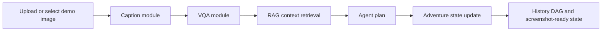
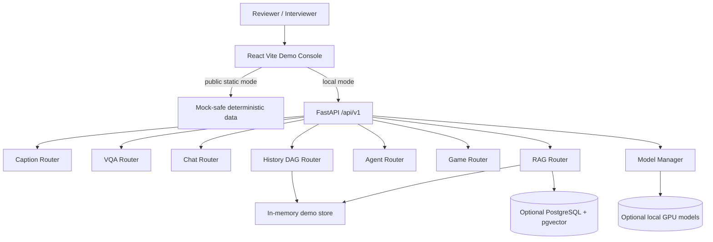
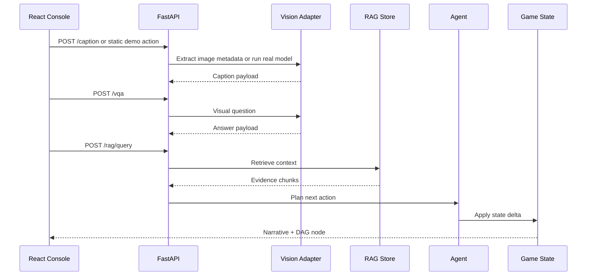
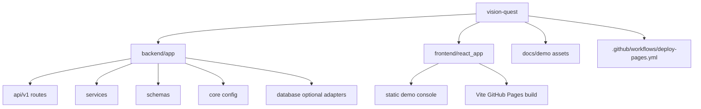
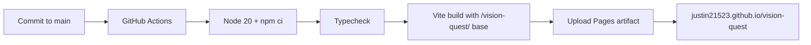
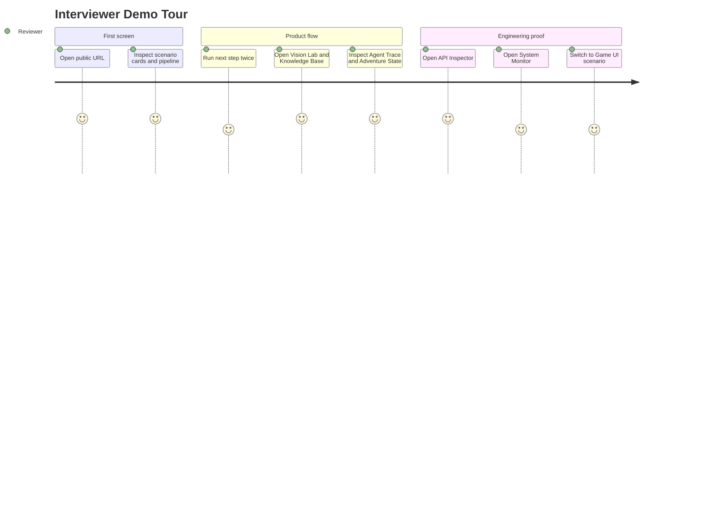
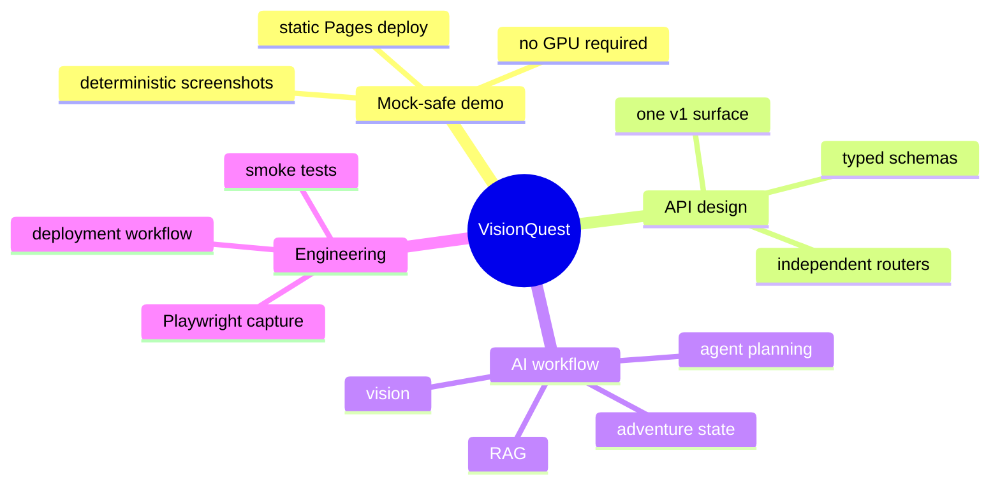

# VisionQuest

VisionQuest is a portfolio-ready multimodal AI demo platform. It presents image captioning, visual question answering, chat, RAG retrieval, agent orchestration, model management, and an interactive adventure flow through one FastAPI API shape and one React console.

The public demo is intentionally mock-safe: it can be opened, screenshotted, recorded, and reviewed without GPU access, model weights, PostgreSQL, pgvector, or external API keys.

| Item | Status |
| --- | --- |
| Public demo | `https://justin21523.github.io/vision-quest/` |
| Backend smoke tests | `7 passed` in mock mode |
| Frontend build | Vite static build for GitHub Pages |
| Demo assets | `docs/demo/screenshots/`, `docs/demo/demo/demo-tour.webm` |
| Portfolio slug | `vision-quest` |

## Product Walkthrough


```mermaid
flowchart LR
    A[Upload or select demo image] --> B[Caption module]
    B --> C[VQA module]
    C --> D[RAG context retrieval]
    D --> E[Agent plan]
    E --> F[Adventure state update]
    F --> G[History DAG and screenshot-ready state]
```

The first screen is the product console itself, not a marketing splash. The left rail controls the demo modules, the center panel visualizes the active image/task, and the right panel shows query, answer, telemetry, and reproducible state.

The current demo includes four reviewer scenarios:

| Scenario | What it demonstrates | Screenshot value |
| --- | --- | --- |
| Museum Archive Intake | caption, VQA, RAG evidence, safe action planning | First-screen product overview |
| Game UI Screenshot Review | HUD parsing, branch state, inventory delta | More realistic interaction flow |
| Research Diagram QA | architecture diagram QA and citation reasoning | Technical explanation surface |
| Product Dashboard Audit | deployment/runbook validation and telemetry | Ops-ready portfolio proof |

## Architecture


```mermaid
graph TD
    U[Reviewer / Interviewer] --> UI[React Vite Demo Console]
    UI -->|public static mode| M[Mock-safe deterministic data]
    UI -->|local mode| API[FastAPI /api/v1]
    API --> CAP[Caption Router]
    API --> VQA[VQA Router]
    API --> CHAT[Chat Router]
    API --> RAG[RAG Router]
    API --> AGENT[Agent Router]
    API --> GAME[Game Router]
    API --> HIST[History DAG Router]
    API --> MODEL[Model Manager]
    RAG --> MEM[In-memory demo store]
    HIST --> MEM
    MODEL --> GPU[(Optional local GPU models)]
    RAG --> PG[(Optional PostgreSQL + pgvector)]
```

## Data Flow


```mermaid
sequenceDiagram
    participant UI as React Console
    participant API as FastAPI
    participant V as Vision Adapter
    participant R as RAG Store
    participant A as Agent
    participant G as Game State

    UI->>API: POST /caption or static demo action
    API->>V: Extract image metadata or run real model
    V-->>API: Caption payload
    UI->>API: POST /vqa
    API->>V: Visual question
    V-->>API: Answer payload
    UI->>API: POST /rag/query
    API->>R: Retrieve context
    R-->>API: Evidence chunks
    API->>A: Plan next action
    A->>G: Apply state delta
    G-->>UI: Narrative + DAG node
```

## Module Organization


```mermaid
flowchart TB
    ROOT[vision-quest]
    ROOT --> BACK[backend/app]
    BACK --> API[api/v1 routes]
    BACK --> SVC[services]
    BACK --> SCH[schemas]
    BACK --> CORE[core config]
    BACK --> DB[database optional adapters]
    ROOT --> FRONT[frontend/react_app]
    FRONT --> APP[static demo console]
    FRONT --> BUILD[Vite GitHub Pages build]
    ROOT --> DOCS[docs/demo assets]
    ROOT --> WF[.github/workflows/deploy-pages.yml]
```

## Technology Stack

| Layer | Technology | Portfolio purpose |
| --- | --- | --- |
| Frontend | React, TypeScript, Vite, CSS | Static interactive demo and screenshot surface |
| Backend | FastAPI, Pydantic, Uvicorn | Stable API shape for local smoke tests |
| Vision demo | Pillow metadata heuristics | GPU-free caption/VQA compatibility path |
| RAG demo | In-memory seeded chunks | Retrieval flow without pgvector dependency |
| Optional AI stack | PyTorch, Transformers, pgvector | Real inference path for local extension |
| Testing | pytest, FastAPI TestClient, Playwright | Backend smoke plus screenshot/video generation |
| Deployment | GitHub Pages, GitHub Actions | Public static demo URL |

## API Surface

| Capability | Endpoint | Demo behavior |
| --- | --- | --- |
| Health | `GET /api/v1/health/` | Returns mock mode, model readiness, CPU/RAM telemetry |
| Caption | `POST /api/v1/caption/` | Reads image dimensions and dominant color |
| VQA | `POST /api/v1/vqa/` | Answers color/size/safety questions with evidence and reasoning |
| Chat | `POST /api/v1/chat/` | Returns deterministic assistant text and optional state delta |
| RAG | `POST /api/v1/rag/ingest/structured`, `GET /api/v1/rag/query` | Returns source, chunk, score, reason, and metadata |
| Agent | `POST /api/v1/agent/chat`, `POST /api/v1/agent/process-image` | Simulates tool planning, trace steps, and next actions |
| Game | `POST /api/v1/game/start`, `POST /api/v1/game/act` | Updates narrative, branch id, choices, and state delta |
| History | `GET /api/v1/history/dag` | Returns screenshot-ready flow nodes, edges, and summary |

## Local Setup

```bash
python -m venv .venv
source .venv/bin/activate
pip install -r backend/requirements.txt
cd frontend/react_app
npm install
```

## Run Locally

Backend:

```bash
USE_MOCK_MODE=true PYTHONPATH=backend uvicorn app.main:app --host 0.0.0.0 --port 8000
```

Frontend:

```bash
cd frontend/react_app
npm run dev
```

Static demo only:

```bash
cd frontend/react_app
GITHUB_PAGES=true npm run build
npm run preview
```

## Test And Build

```bash
USE_MOCK_MODE=true PYTHONPATH=backend python -m pytest backend/tests -q
PYTHONPATH=backend python -m compileall -q backend/app
cd frontend/react_app
npm run typecheck
npm run build
npm run capture:demo
```

## Deployment


```mermaid
flowchart LR
    C[Commit to main] --> A[GitHub Actions]
    A --> N[Node 20 + npm ci]
    N --> T[Typecheck]
    T --> B[Vite build with /vision-quest/ base]
    B --> P[Upload Pages artifact]
    P --> URL[justin21523.github.io/vision-quest]
```

The workflow lives at `.github/workflows/deploy-pages.yml`. It deploys `frontend/react_app/dist` to GitHub Pages.

## Demo Assets

| Asset | Path |
| --- | --- |
| Cover image | `docs/demo/cover.png` |
| Guided video | `docs/demo/demo/demo-tour.webm` |
| Workspace overview | `docs/demo/screenshots/01-workspace-overview.png` |
| Pipeline running | `docs/demo/screenshots/02-pipeline-running.png` |
| Vision Lab | `docs/demo/screenshots/03-vision-lab.png` |
| Knowledge Base | `docs/demo/screenshots/04-knowledge-base.png` |
| Agent Trace | `docs/demo/screenshots/05-agent-trace.png` |
| Adventure State | `docs/demo/screenshots/06-adventure-state.png` |
| API Inspector | `docs/demo/screenshots/07-api-inspector.png` |
| System Monitor | `docs/demo/screenshots/08-system-monitor.png` |
| Alternate scenario | `docs/demo/screenshots/09-scenario-game-ui.png` |

## Recording Flow


```mermaid
journey
    title Interviewer Demo Tour
    section First screen
      Open public URL: 5: Reviewer
      Inspect scenario cards and pipeline: 5: Reviewer
    section Product flow
      Run next step twice: 4: Reviewer
      Open Vision Lab and Knowledge Base: 5: Reviewer
      Inspect Agent Trace and Adventure State: 5: Reviewer
    section Engineering proof
      Open API Inspector: 5: Reviewer
      Open System Monitor: 4: Reviewer
      Switch to Game UI scenario: 4: Reviewer
```

## Interview Highlights


```mermaid
mindmap
  root((VisionQuest))
    Mock-safe demo
      no GPU required
      deterministic screenshots
      static Pages deploy
    API design
      one v1 surface
      independent routers
      typed schemas
    AI workflow
      vision
      RAG
      agent planning
      adventure state
    Engineering
      smoke tests
      Playwright capture
      deployment workflow
```

Key points for reviewers:

1. The project demonstrates how to present heavyweight AI workflows without making the public demo depend on heavyweight infrastructure.
2. The backend keeps a realistic API contract, so the mock-safe demo can be replaced by real model adapters later.
3. The UI is designed for portfolio evidence: first-screen product view, reproducible states, screenshots, and a short guided video.
4. The README maps architecture, data flow, deployment, API surface, and module organization with diagrams.

## Known Risks

| Risk | Current handling |
| --- | --- |
| Real BLIP/LLaVA/Qwen model weights are not bundled | Public demo uses deterministic adapters |
| PostgreSQL/pgvector may not be available locally | Demo RAG/history use in-memory data |
| GPU inference can vary by hardware | GPU mode is opt-in and documented separately |
| Public Pages cannot run FastAPI | Pages hosts the static React demo; backend is verified locally |
